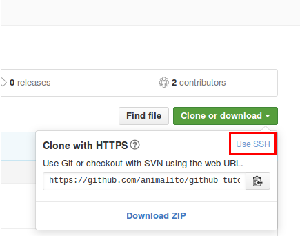
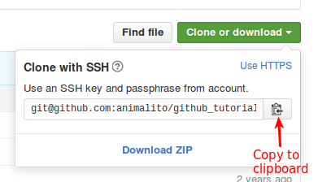

github_tutorial
===============

Mini tutorial emphasizing uses in multidisciplinary projects! Git/github is [not just for coders](http://thepoliticalmethodologist.com/2013/11/18/gitgithub-transparency-and-legitimacy-in-quantitative-research/)!

*If you also love git and are trying to get your team to use it, feel free to contribute!

# Installation

## Windows

The *first* and most important thing you have to ask yourself is: Why, why, why am I **still in Windows**? 

The *second* thing to ask yourself is: Why do I keep **doing this to myself**?

If you choose not to hear this advice, [here's](http://msysgit.github.io/) what you gotta do to have git on Windows.

## Linux

###Fedora 
```bash
$ yum install git-core
```

###Debian
```bash
$ apt-get install git
```

## Mac

Hahaha you spent a LOT of money! Don't be so *fresa*.

Did you see how **easy** it was for Linux users? There are two ways for you:

1. [Via the git installer](http://code.google.com/p/git-osx-installer)
2. With [MacPorts](http://www.macports.org) installed:

```bash
$ sudo port install git-core +svn +doc +bash_completion +gitweb
```

# The basic global setup


Git (or github) is, in my opinion, a pretty awesome way to work in teams because it facilitates sharing and integrating work and it makes everyone accountable for the tasks that are assigned to them.

For the second reason, you have to tell github who you are:

```git 
$ git config --global user.name "Your Name"
$ git config --global user.email "your_email@whatever.com"
```

Once you do this, everything that you upload/update/do will have your name attached in the history of your repo (accountability FTW!)

One last thing...

If on a Mac also add:
```git
$ git config --global core.autocrlf input
$ git config --global core.safecrlf true
```
If on Windows also add:
```git
$ git config --global core.autocrlf true
$ git config --global core.safecrlf true
```
This will setup line ending preferences.

# Pimping it up some mo'!

You can also tell git which editor you prefer (obviously, my example is with emacs but you plug in your favourite!)
```git
$ git config --global core.editor emacs
```
Lastly, for resolving merge conflicts, you can setup where you want to do it!
```git
$ git config --global merge.tool emerge
```

Let's check out our setup:
```git
$ git config --list
```

[More info on setup.](http://git-scm.com/book/en/Getting-Started-First-Time-Git-Setup)

# Getting help

No one (and I mean **no one**) knows everything. Knowing how to access the documentation is always your best bet.

To access git's manpage just do:
```git
$ git help <verb>
$ git <verb> --help
$ man git-<verb>
```
where <verb> refers to any command you want! (If you know not any command, ask Google what you wanna do and start checking out all the possibilities to make your life easier!)

# Handling credentials


You obviously do not want to add your credentials every single time you want to `clone`, `pull` or `push` from a repo in github.

## ssh 

My prefered choice, is via `ssh`. You just have to follow the appropiate instructions for you operating system in [here](https://help.github.com/articles/generating-a-new-ssh-key-and-adding-it-to-the-ssh-agent/)
and you will never again worry about inputing your credentials. It is the safest way to connect your local 
versions of the repos with github.

Once your credentials are configured, be sure to *clone* the repositories using the appropiate ssh connector, that is
go to the repo in github, e.g. [this tutorial's repo](https://github.com/animalito/github_tutorial) and go to *Clone or download*
on the right top corner and select use ssh as shown:



Copy the url for the repo 
 


Now spin up a terminal and go to the folder where you intend to parent your repo and type

```
git clone git@github.com:animalito/github_tutorial.git
```

## https

You can also set it up via https and caching your credential by using the [credential helper](https://help.github.com/articles/caching-your-github-password-in-git/)


# What is this weird (but awesome) .md file?

To write beautiful stuff (like this document), use Markdown! It really is awesome.

For an [amazing cheatsheet.](https://github.com/adam-p/markdown-here/wiki/Markdown-Here-Cheatsheet#wiki-hr)

Incidentally, you can easily turn a markdown file into a presentation! For those RStudio users, [checkout this one out.](http://rmarkdown.rstudio.com/)


# Anything else?

If you find this useful, want to contribute or whatever, don't be a stranger! Drop us a line.


